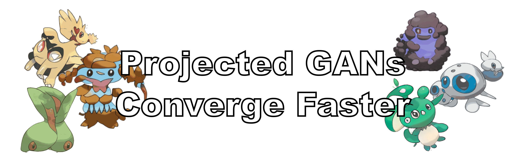

#### [[Project]](https://sites.google.com/view/projected-gan/) [[PDF]](http://www.cvlibs.net/publications/Sauer2021NEURIPS.pdf) [[Supplementary]](http://www.cvlibs.net/publications/Sauer2021NEURIPS_supplementary.pdf) [[Talk]](https://recorder-v3.slideslive.com/#/share?share=50538&s=bf7a6393-410c-49d9-8edf-c61fa486c354) [[CGP Summary]](https://www.casualganpapers.com/data-efficient-fast-gan-training-small-datasets/ProjectedGAN-explained.html) [[Replicate Demo]](https://replicate.com/xl-sr/projected_gan) [[Hugging Face Spaces Demo]](https://huggingface.co/spaces/autonomousvision/projected_gan)

For a quick start, try the Colab: &nbsp; [](https://colab.research.google.com/gist/xl-sr/757757ff8709ad1721c6d9462efdc347/projected_gan.ipynb)

This repository contains the code for our NeurIPS 2021 paper "Projected GANs Converge Faster"

by [Axel Sauer](https://axelsauer.com/), [Kashyap Chitta](https://kashyap7x.github.io/), [Jens Müller](https://hci.iwr.uni-heidelberg.de/users/jmueller), and [Andreas Geiger](http://www.cvlibs.net/).

If you find our code or paper useful, please cite
```bibtex
@InProceedings{Sauer2021NEURIPS,
  author         = {Axel Sauer and Kashyap Chitta and Jens M{\"{u}}ller and Andreas Geiger},
  title          = {Projected GANs Converge Faster},
  booktitle      = {Advances in Neural Information Processing Systems (NeurIPS)},
  year           = {2021},
}
```
## Related Projects ##
- [StyleGAN-XL: Scaling StyleGAN to Large Diverse Datasets](https://github.com/autonomousvision/stylegan_xl)

## ToDos
- [x] Initial code release
- [x] Easy-to-use colab
- [x] StyleGAN3 support (moved  to https://github.com/autonomousvision/stylegan_xl)
- [x] Providing pretrained models

## Requirements ##
- 64-bit Python 3.8 and PyTorch 1.9.0 (or later). See https://pytorch.org for PyTorch install instructions.
- Use the following commands with Miniconda3 to create and activate your PG Python environment:
  - ```conda env create -f environment.yml```
  - ```conda activate pg```
- The StyleGAN2 generator relies on custom CUDA kernels, which are compiled on the fly. Hence you need:
  - CUDA toolkit 11.1 or later.
  - GCC 7 or later compilers. Recommended GCC version depends on CUDA version, see for example CUDA 11.4 system requirements.
  - If you run into problems when setting up for the custom CUDA kernels, we refer to the [Troubleshooting docs](https://github.com/NVlabs/stylegan3/blob/main/docs/troubleshooting.md#why-is-cuda-toolkit-installation-necessary) of the original StyleGAN repo. When using the FastGAN generator you will not need the custom kernels.

## Data Preparation ##
For a quick start, you can download the few-shot datasets provided by the authors of [FastGAN](https://github.com/odegeasslbc/FastGAN-pytorch). You can download them [here](https://drive.google.com/file/d/1aAJCZbXNHyraJ6Mi13dSbe7pTyfPXha0/view). To prepare the dataset at the respective resolution, run for example
```
python dataset_tool.py --source=./data/pokemon --dest=./data/pokemon256.zip \
  --resolution=256x256 --transform=center-crop
```
You can get the datasets we used in our paper at their respective websites: 

[CLEVR](https://cs.stanford.edu/people/jcjohns/clevr/), [FFHQ](https://github.com/NVlabs/ffhq-dataset), [Cityscapes](https://www.cityscapes-dataset.com/), [LSUN](https://github.com/fyu/lsun), [AFHQ](https://github.com/clovaai/stargan-v2), [Landscape](https://www.kaggle.com/arnaud58/landscape-pictures).

## Training ##

Training your own PG on LSUN church using 8 GPUs:
```
python train.py --outdir=./training-runs/ --cfg=fastgan --data=./data/pokemon256.zip \
  --gpus=8 --batch=64 --mirror=1 --snap=50 --batch-gpu=8 --kimg=10000
```
```--batch``` specifies the overall batch size, ```--batch-gpu``` specifies the batch size per GPU.  If you use fewer GPUs, the training loop will automatically accumulate gradients, until the overall batch size is reached.

If you want to use the StyleGAN2 generator, pass ```--cfg=stylegan2```.
We also added a lightweight version of FastGAN (```--cfg=fastgan_lite```). This backbone trains fast regarding wallclock
time and yields better results on small datasets like Pokemon.
Samples and metrics are saved in ```outdir```. To monitor the training progress, you can inspect fid50k_full.json or run tensorboard in training-runs.

## Generating Samples & Interpolations ##

To generate samples and interpolation videos, run
```
python gen_images.py --outdir=out --trunc=1.0 --seeds=10-15 \
  --network=PATH_TO_NETWORK_PKL
```
and
```
python gen_video.py --output=lerp.mp4 --trunc=1.0 --seeds=0-31 --grid=4x2 \
  --network=PATH_TO_NETWORK_PKL
```

We provide the following pretrained models (pass the url as `PATH_TO_NETWORK_PKL`):
  > <sub>`https://s3.eu-central-1.amazonaws.com/avg-projects/projected_gan/models/art_painting.pkl`</sub><br>
  > <sub>`https://s3.eu-central-1.amazonaws.com/avg-projects/projected_gan/models/church.pkl`</sub><br>
  > <sub>`https://s3.eu-central-1.amazonaws.com/avg-projects/projected_gan/models/bedroom.pkl`</sub><br>
  > <sub>`https://s3.eu-central-1.amazonaws.com/avg-projects/projected_gan/models/cityscapes.pkl`</sub><br>
  > <sub>`https://s3.eu-central-1.amazonaws.com/avg-projects/projected_gan/models/clevr.pkl`</sub><br>
  > <sub>`https://s3.eu-central-1.amazonaws.com/avg-projects/projected_gan/models/ffhq.pkl`</sub><br>
  > <sub>`https://s3.eu-central-1.amazonaws.com/avg-projects/projected_gan/models/flowers.pkl`</sub><br>
  > <sub>`https://s3.eu-central-1.amazonaws.com/avg-projects/projected_gan/models/landscape.pkl`</sub><br>
  > <sub>`https://s3.eu-central-1.amazonaws.com/avg-projects/projected_gan/models/pokemon.pkl`</sub><br>
  
## Quality Metrics ##
Per default, ```train.py``` tracks FID50k during training. To calculate metrics for a specific network snapshot, run

```
python calc_metrics.py --metrics=fid50k_full --network=PATH_TO_NETWORK_PKL
```

To see the available metrics, run
```
python calc_metrics.py --help
```

## Using PG in your own project ##

Our implementation is modular, so it is straightforward to use PG in your own codebase. Simply copy the ```pg_modules``` folder to your project.
Then, to get the projected multi-scale discriminator, run
```
from pg_modules.discriminator import ProjectedDiscriminator
D = ProjectedDiscriminator()
```
The only thing you still need to do is to make sure that the feature network is not trained, i.e., explicitly set
```
D.feature_network.requires_grad_(False)
```
in your training loop.

## Acknowledgments ##
Our codebase build and extends the awesome [StyleGAN2-ADA repo](https://github.com/NVlabs/stylegan2-ada-pytorch) and [StyleGAN3 repo](https://github.com/NVlabs/stylegan3), both by Karras et al.

Furthermore, we use parts of the code of [FastGAN](https://github.com/odegeasslbc/FastGAN-pytorch) and [MiDas](https://github.com/isl-org/MiDaS).
